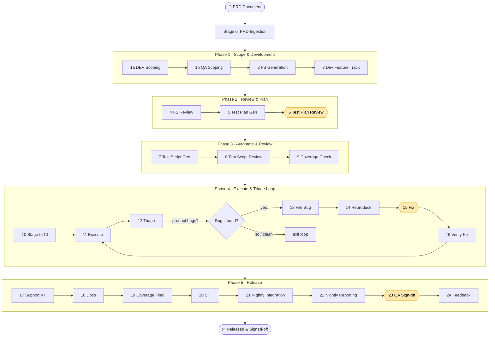

# 🤖 CrewAI SDLC Orchestrator

**An end-to-end, multi-agent AI system that automates the software delivery
lifecycle — from a product requirements doc (PRD) all the way to QA sign-off.**

Built on [CrewAI](https://docs.crewai.com), it coordinates **25 specialized AI
agents** across **24 stages** and **5 phases**, with full artifact traceability,
checkpoint-based resume, automatic retries, a self-correcting triage loop, and
human-in-the-loop approval gates.

> Runs **100% locally** by default with [Ollama](https://ollama.com) + **Mistral**
> — no API keys, no cloud cost. OpenAI / Anthropic are optional drop-ins.

---

## 📑 Table of Contents
- [The Problem](#-the-problem)
- [The Solution](#-the-solution)
- [Key Features](#-key-features)
- [How It Works](#-how-it-works-orchestration)
- [End-to-End Flow](#-end-to-end-flow)
- [The 5 Phases & 24 Stages](#-pipeline-phases)
- [The 25 AI Agents](#-the-25-ai-agents)
- [Project Structure](#-project-structure)
- [Setup](#-setup)
- [Running Tests](#-running-tests)

---

## 🔴 The Problem

In most product companies, the software testing & release lifecycle is **slow,
manual, and fragmented**:

- **Hand-offs everywhere** — requirements → dev → test design → test scripting →
  execution → bug triage → fixes → release. Each hand-off loses context and adds delay.
- **Repetitive, low-leverage work** — engineers spend days writing functional
  specs, test plans, and test scripts by hand for every feature.
- **Slow bug loops** — triaging failures, filing bugs, reproducing, fixing, and
  re-verifying is a manual back-and-forth that can take weeks.
- **No traceability** — it's hard to prove a requirement was tested, or to resume
  a half-finished release if something breaks.
- **Inconsistent quality** — outcomes depend on who did the work, not a repeatable process.

## 🟢 The Solution

This project models the **entire lifecycle as a pipeline of AI agents**. You give
it a PRD; it drives every downstream stage automatically — generating specs, test
plans, and scripts, executing them, triaging failures, filing & fixing bugs,
verifying fixes, and producing release artifacts — **pausing only where a human
must approve**.

- A **PRD goes in**, a fully tested, signed-off, documented release **comes out**.
- Every stage's output is a **typed, stored artifact** referenced by ID — full traceability.
- The pipeline can **resume from any checkpoint**, **retry** transient failures, and
  **loop** on bugs until tests pass.
- **Humans stay in control** at the gates that matter (test-plan approval, fixes, final sign-off).

---

## ✨ Key Features

- **25 specialized agents** organized into Dev, QA, Automation, and Release teams.
- **24-stage pipeline** across 5 phases, defined declaratively in YAML.
- **Self-correcting triage loop** — execute → triage → file bug → reproduce → fix → verify, repeated until clean.
- **Human-in-the-loop approval gates** with a full audit trail.
- **Artifact store** (SQLite, swappable to Postgres/S3) — every output is persisted and traceable.
- **Checkpoint & resume** — restart a pipeline exactly where it stopped.
- **Configurable retries** with exponential backoff for transient errors.
- **Local-first LLM** via Ollama + Mistral; provider-agnostic by design.
- **Telemetry** for stage/pipeline metrics and lifecycle events.

---

## 🧩 How It Works (Orchestration)

The orchestration is built from a few clean, decoupled pieces:

| Component | Responsibility |
|-----------|----------------|
| **`PipelineRunner`** | Drives all 24 stages in order, runs the triage loop, enforces approval gates. |
| **`CrewFactory`** | Builds a single-agent CrewAI *crew* per stage (one focused agent + its task + tools). |
| **`ArtifactStore`** | Persists every stage output as a typed artifact, referenced downstream by ID. |
| **`StateManager` + `CheckpointStore`** | Save `PipelineState` after each stage so runs can resume. |
| **`ApprovalManager`** | Opens human-approval gates and records decisions (with timeout & audit trail). |
| **`RetryPolicy`** | Retries transient failures with exponential backoff. |
| **`Telemetry`** | Emits lifecycle events and aggregates metrics. |

**Orchestration style:** each stage is an independent CrewAI crew running a single
expert agent (a *sequential* process). Stages are chained by the `PipelineRunner`,
which passes artifact IDs forward — never in-memory objects — so the flow is
durable, resumable, and auditable. Agents and stages are configured in
`agents.yaml`, `pipeline.yaml`, and `platforms.yaml`, so you can change behavior
without touching code.

---

## 🔄 End-to-End Flow



> 🟡 Diamond/hexagon nodes (**6 Test Plan Review**, **15 Fix**, **23 QA Sign-off**)
> are **human approval gates**. Phase 4 is a **loop** that keeps fixing bugs until
> tests pass (bounded by `MAX_TRIAGE_LOOPS`).

---

## 📂 Project Structure

```
crewai-sdlc-orchestrator/
├── app/
│   ├── main.py                  # Entry point / CLI
│   ├── config/
│   │   ├── platforms.yaml       # CORE / CLOUD / EDGE platform configs + available agents
│   │   ├── agents.yaml          # Agent roles, goals, backstories, ownership
│   │   └── pipeline.yaml        # Stage definitions, approval gates, triage loop
│   ├── agents/
│   │   ├── dev_agent.py          # DEV agents: Scoping(1a), FS Gen(2), Dev Track(3)
│   │   ├── qa_agent.py          # QA agents: Scoping(1b), FS Review(4), TP Gen(5), TP Review(6), TS Gen(7), TS Review(8), Coverage(9)
│   │   ├── automation_agent.py  # Stage(10), Execute(11), Triage(12), Bug(13-14), Fix(15), FixVerify(16)
│   │   └── release_agent.py     # Support KT(17), Docs(18), Coverage Final(19), SIT(20), Nightly(21-22), QA(23), Feedback(24)
│   ├── tasks/
│   │   ├── scoping.py           # Stage 1a, 1b tasks
│   │   ├── fs.py               # Stage 2, 3, 4 tasks
│   │   ├── test_plan.py         # Stage 5, 6 tasks
│   │   ├── test_scripts.py      # Stage 7, 8, 9 tasks
│   │   ├── execution.py         # Stage 10, 11 tasks
│   │   ├── triage.py            # Stage 12-16 (triage loop) tasks
│   │   └── release.py           # Stage 17-24 tasks
│   ├── models/
│   │   ├── artifacts.py         # Pydantic models for all 24+ artifact types
│   │   ├── pipeline_state.py    # PipelineState, StageRun, status enums
│   │   ├── approvals.py         # ApprovalRequest, ApprovalDecision
│   │   └── telemetry.py         # TelemetryEvent, StageMetrics, PipelineMetrics
│   ├── orchestration/
│   │   ├── crew_factory.py      # Creates per-stage CrewAI Crew instances
│   │   ├── pipeline_runner.py   # Main pipeline execution with triage loop
│   │   ├── state_manager.py     # Wraps PipelineState + CheckpointStore
│   │   ├── approval_manager.py  # Human approval request lifecycle
│   │   └── retry_policy.py      # Configurable retry with exponential backoff
│   ├── tools/
│   │   ├── ci_tool.py        # CI staging + execution tools
│   │   ├── bug_tool.py          # IssueTracker bug filing + update tools
│   │   ├── docs_tool.py         # Artifact read/write tools
│   │   └── notification_tool.py # Chat, email, approval notification tools
│   ├── storage/
│   │   ├── artifact_store.py    # SQLite artifact persistence (swap to Postgres/S3)
│   │   └── checkpoint_store.py  # SQLite checkpoint persistence for resume
│   └── telemetry/
│       ├── callbacks.py         # Pipeline/stage lifecycle event emitter
│       └── metrics.py           # Metrics aggregation from events
└── tests/
    └── unit/
        ├── test_models.py       # Artifact + state model tests
        ├── test_retry_policy.py # Retry policy behavior tests
        └── test_storage.py      # Artifact + checkpoint store tests
```

---

## 🧭 Pipeline Phases

| Phase | Stages | Ownership |
|-------|--------|-----------|
| 1 — Scope & Development | 1a DEV Scope → 1b QA Scope → 2 FS Gen → 3 Dev Track | DEV + QA |
| 2 — Review & Plan | 4 FS Review → 5 TP Gen → 6 TP Review ✅ | QA + Co-owned |
| 3 — Automate & Review | 7 TS Gen → 8 TS Review → 9 Coverage Check | QA |
| 4 — Execute & Triage Loop | 10 Stage → 11 Execute → 12 Triage → 13 Bug File → 14 Bug Repro → 15 Fix ✅ → 16 Verify Fix | QA + Co-owned |
| 5 — Release | 17 Support KT → 18 Docs → 19 Coverage Final → 20 SIT → 21 Nightly → 22 Reporting → 23 QA Sign-off ✅ → 24 Feedback | QA |

✅ = Human approval gate

---

## 👥 The 25 AI Agents

Each agent is a focused expert with its own role, goal, and tools — configured in
[`app/config/agents.yaml`](app/config/agents.yaml).

### 🛠️ Dev team (3)
| Agent | Role |
|-------|------|
| `dev_scoping` | Development Engineering Scoping Expert |
| `fs_generator` | Software Functional Specification Author |
| `dev_feature_track` | Development Feature Track Engineer |

### 🧪 QA / Test-design team (7)
| Agent | Role |
|-------|------|
| `qa_scoping` | Test Design Scoping Expert |
| `fs_reviewer` | FS Review Specialist |
| `test_plan_generator` | Test Plan Generation Expert |
| `test_plan_reviewer` | Test Plan Review Coordinator |
| `test_script_generator` | Automated Test Script Engineer |
| `test_script_reviewer` | Test Script Code Reviewer |
| `coverage_analyst` | Test Coverage Analyst |

### 🔁 Automation / Triage-loop team (7)
| Agent | Role |
|-------|------|
| `stage_agent` | Test Staging Engineer |
| `execute_agent` | Test Execution Engine |
| `triage_agent` | Test Failure Triage Specialist |
| `bug_file_agent` | Bug Filing Engineer |
| `bug_repro_agent` | Bug Reproduction Specialist |
| `fix_agent` | Bug Fix Engineer |
| `fix_verify_agent` | Fix Validation Engineer |

### 🚀 Release team (8)
| Agent | Role |
|-------|------|
| `support_kt_agent` | Support Knowledge Transfer Author |
| `docs_agent` | Feature Documentation Engineer |
| `coverage_final_agent` | Final Coverage Report Analyst |
| `sit_agent` | System Integration Test Engineer |
| `nightly_integration_agent` | Nightly Integration Engineer |
| `nightly_reporting_agent` | Nightly Report Analyst |
| `qa_signoff_agent` | QA Sign-off Coordinator |
| `feedback_agent` | SDLC Feedback Collector |

---

## 🚀 Setup

### 1. Install the local LLM (Ollama + Mistral)

```bash
# Install Ollama from https://ollama.com, then pull the model
ollama pull mistral
```

### 2. Install dependencies

```bash
poetry install
```

### 3. Configure environment

```bash
cp .env.example .env
# Defaults to local Ollama — no API keys needed.
# (Optionally add OpenAI/Anthropic keys to use a cloud provider.)
```

### 4. Run the pipeline

```bash
# Start a new pipeline (local Ollama/Mistral by default)
python app/main.py --prd prd_001 --feature feat_user_login --platform CLOUD

# Resume a paused pipeline
python app/main.py --resume pipeline_abc123

# Use a cloud provider instead of local Ollama
python app/main.py --prd prd_001 --feature feat_001 --platform CORE --llm anthropic
```

---

## Key Design Decisions

### Provider-Agnostic (local-first)
Defaults to a local **Ollama** model (Mistral) so it runs with no API keys or cloud cost. The LLM provider is configured via the `--llm` flag (`ollama` / `openai` / `anthropic`) or `LLM_PROVIDER` env var. Adding a new provider requires only a new `build_llm()` branch in `main.py`.

### Artifact Data Contracts
Every artifact is a Pydantic model. Stages produce typed outputs stored in `ArtifactStore`. Downstream stages reference upstream artifacts by ID — never by in-memory references.

### Checkpoint & Resume
`CheckpointStore` persists `PipelineState` after every stage. `--resume PIPELINE_ID` loads the latest checkpoint and skips all completed stages.

### Triage Loop
Phase 4 runs a configurable loop (max `MAX_TRIAGE_LOOPS`). The loop exits when the triage report contains zero product bugs, or when the loop limit is reached.

### Human-in-the-Loop
Stages with `human_input=True` in their CrewAI task pause for human input. `ApprovalManager` tracks approval requests and decisions with full audit trail.

### Platform-Specific Agents
`platforms.yaml` defines which stages and tools are available per platform (CORE/CLOUD/EDGE). `CrewFactory` respects this when building crews.

---

## 🧪 Running Tests

```bash
poetry run pytest
```

Or, without Poetry / CrewAI installed (the core is import-safe), the unit and
**end-to-end integration tests run with only lightweight deps**:

```bash
pip install pytest pydantic pydantic-settings pyyaml
pytest
```

- **Unit tests** (`tests/unit/`) cover the models, storage, retry policy, and PRD ingester.
- **Integration tests** (`tests/integration/`) run the *full 24-stage pipeline*
  end-to-end with a fake crew factory (no LLM required), verifying phase
  sequencing, artifact persistence, the triage loop, and the human-approval gates.

---

## Adding a New Stage

1. Add the stage definition to `config/pipeline.yaml`
2. Add the agent config to `config/agents.yaml`
3. Create the task function in the appropriate `tasks/` file
4. Create the agent builder in the appropriate `agents/` file
5. Add a crew builder method to `orchestration/crew_factory.py`
6. Call the new crew in `orchestration/pipeline_runner.py`
